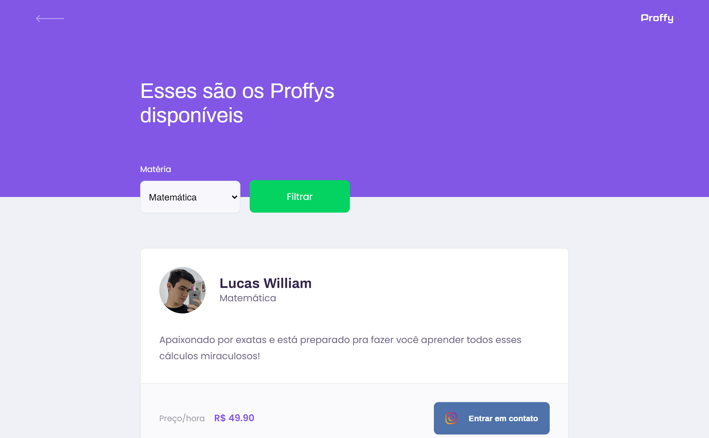

## Proffy 
Projeto realizado na NLW#2 promovida pela Rocketseat &nbsp;   

## Tecnologias usadas 

 &nbsp;&nbsp;JavaScript com NodeJs no backend

 &nbsp;&nbsp;Css

 &nbsp;&nbsp;HTML

 &nbsp; SqLite como banco de dados

#                  Lading page

#                 Study page                            

#                  Give classes page

 
